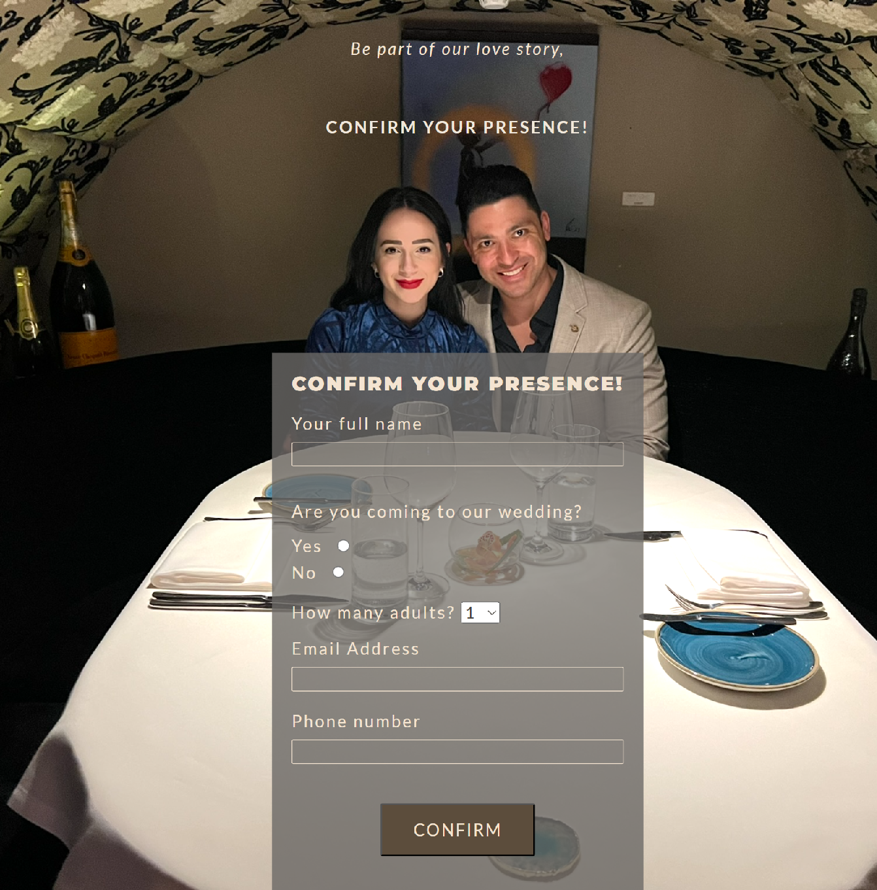

# Amanda & Marcus - Wedding Website

Amanda & Marcus wedding website is my idea of website for engaged couples who are getting merried and they want to share information with their guest quickly and virtually.

The main objective of this website is to confirm attendance and control the guest list, provide information about the wedding (where the ceremony and celebration will be, with date, time and location) and show a little bit story of each one and how they met.

## Features

### Header

- The Header is featured at the top of the page.
- Shows the logo with the couple's initials in the left corner with a styled Font Awesome icon red (fa-heart) in the middle.
- When the logo is clicked on it will take the user to the top of the page (home page).
- The right part contains the navigation bar icon for small screen or the links when the screen a 992px or largger.
- On smart phones and tables,
- On bigger screens the links are displyed on the navbar in a row.

#### Navigation

- The navigation bar is located on the rigth part of the header and contains all the sections of the website: Home page, Our Story, Details, Gallery and RSVP.
- When on smaller devices the navbar links are hidden and just the burguer icon is shown. You need to click on the styled Font Awesome icon (fa-bars) to display the links.

- On bigger screens the links are displyed on the navbar in a row.
- The navigation uses position fixed, it allows the user to easily navigate as it will always be visible when scrolling the page.

### Home Section

- This section includes a background image of the couple who is getting merried.
- The background uses position fixed, this gives a nice effect when scrolling down the page.
- A large and visible text with a Couple's name and the date of the wedding between the two names displayed in a small size. "Oooh Baby" font family was used as a font for the names.
- The position of the couple's text was centered left.

### Welcome Section

- This section is the introduction of the website.
- On the very top there is a countdown clock displaying how many days, hours, minutes and seconds left to the wedding.
- Below the countdown there is a centered welcome message to te guests followed by a nice message.
- For the last on the botton of the section there is a nice brief message about what the visitors are about to see and share with the couple.

### Our Story Section

- This section shares with the invited users a little about the bride and groom's love story.
- Shows one image of the couple kissing at a New Years party.
- The two messages are followed by a nice verse from the bible.

### Details Section

- The details section is the section where the users will find the details of the wedding. Ceremony and Celebration information.
- The section starts with a brief message about what the section is going to show.
- There are two images. One for the ceremony and another one for the celebration party. Each picture is followed by a message discribing the location and some tips about the big day.
- After the image there is a block of text containing where and when the celebration/ceremony will happen.
- To make eassier for the users to find the location, a google maps was added for the last.

### Gallery Section

- This section shares with the users 13 pictures of the couple since they have met.
- On small screens up to 576px, the pictures are show in 1 column.
- For screens bigger than 576px up to 992px, pictures are shown in 2 columns.
- For screens larger than 992px up to 1250px, pictures are show in 3 columns
- For screens larger than 1250px up to 1600px, pictures are show in 4 columns. For XXLarger screens or bigger than 1600px, pictures are shown in 5 columns.

### RSVP Section

- This is the most important section of the website. It is as valuable for the guest as it is to the bride and the groom.
- It contains a confirmation of presence form submitted feature.
- The form collects datas like the Full name, a question "Arem you coming to the wedding?" with an Yes or no question, how many adults are coming, email address and phone number.

## Technologies Used

- HTML5
- CSS3
- [Google Fonts:](https://fonts.google.com/) To import font family ’Poppins’ into the style.css file which is used on all pages.
  Added fallback font sans-serif.
- [Font Awesome:](https://fontawesome.com/) Was used in header and contact section to add icons for aesthetic and UX purposes.
- [Tiny PNG:](https://tinypng.com/) Compressing images to smaller sizes.
- [Multi device mockups:](https://techsini.com/multi-mockup/) Checking the responsive.
- [Git](https://git-scm.com/) Git was used for version control by utilizing the Gitpod terminal to commit to Git and Push to GitHub.
- [GitHub:](https://github.com/) GitHub is used to store the projects code after being pushed from Git.

### Validator Testing

Oficials validator services were used to validate all pages of the project and no erros were found when passing through WC3 and Jigsaw validator

- W3C Markup Validator
  

- W3C CSS Validator
  

- Lighthouse Validator
  

### Unfixed Bugs

No unfixed bugs

- The website was deployed to GitHub pages. The steps to deploy are as follows:

  - Log in to GitHub and locate the GitHub Repository.
  - In the GitHub repository, navigate to the "Settings" tab.
  - In Settings, choose "Pages" from the left hand menu.
  - Under "Source", select branch "Main" and select folder "(Root)".
  - Click Save and the page will be automatically refreshed with a link to the completed website indicating the successful deployment.

  [View the live project here.]https://marcus-andre.github.io/wedding-amanda-marcus/

  ### Credits

  #### Content

  - The scrip for the countdown clock was taken from https://bootstrapexamples.com/@moana-silva/countdown-timer/fullscreen-preview.
  - The idea of the confirmation form was taken from [Love Running]("https://marcus-andre.github.io/love-running/")

  #### Media

  - All the images of the couples are personal pictures as the bride and broom in the website are myself and my girlfriend.

  ### Acknowledgements

  - My mentor at Code Institute for helpful feedback.
